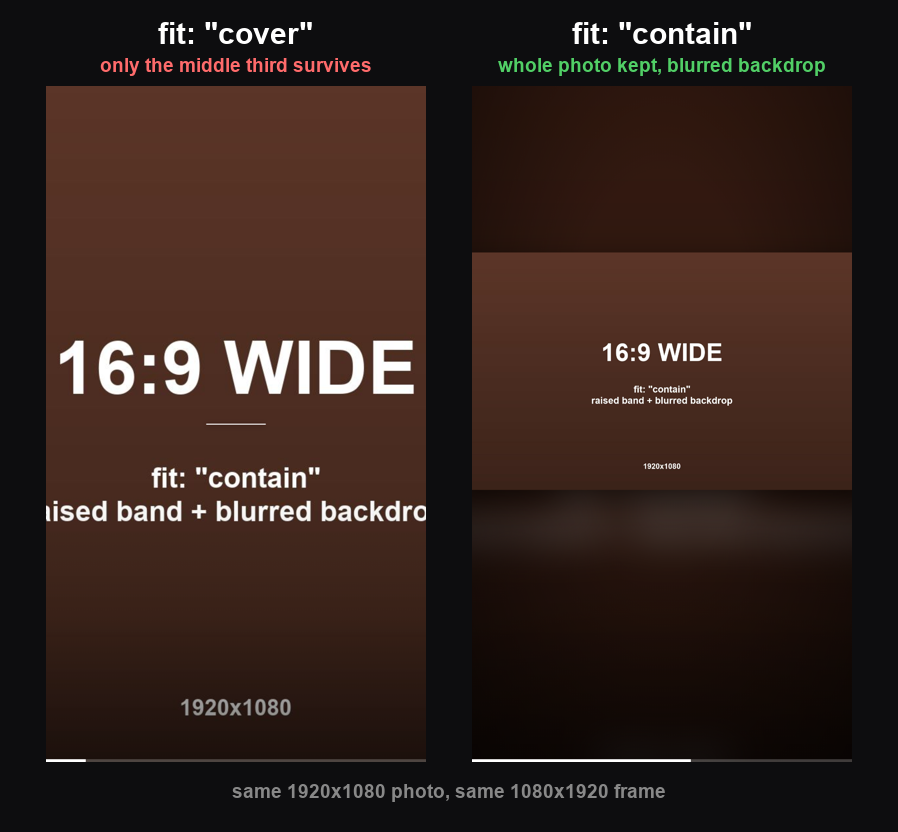
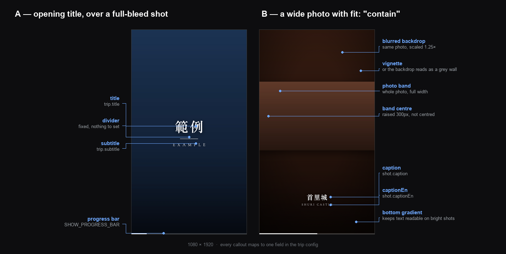
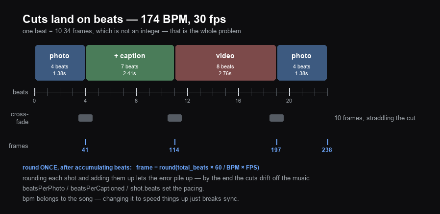

<p align="right"><b>English</b> · <a href="README.md">繁體中文</a></p>

# beat-reel

Turn a folder of phone photos into a beat-synced 9:16 short.

Photo-led, cuts landing on the music's beats, bilingual place-name captions.
Outputs a 1080×1920 mp4 ready for Instagram Reels, YouTube Shorts and TikTok.

It is a Claude Code plugin. Once installed, saying *"cut these photos into a video"*
is enough — you don't have to remember any commands. The Remotion project inside
also works on its own as an ordinary npm project.

---

## Contents

- [The problem it solves](#the-problem-it-solves)
- [The one figure that matters most](#the-one-figure-that-matters-most)
- [What's on screen](#whats-on-screen)
- [Install](#install)
- [Cutting your first reel](#cutting-your-first-reel)
- [How cuts land on beats](#how-cuts-land-on-beats)
- [Writing the config](#writing-the-config)
- [The editing judgement lives in craft.md](#the-editing-judgement-lives-in-craftmd)
- [What it does not do](#what-it-does-not-do)
- [Requirements](#requirements)
- [Where things are](#where-things-are)

---

## The problem it solves

Here is what a trip folder actually looks like — **real numbers** from a five-day
Singapore trip:

```
raw material                      210 photos, 118 videos
  ├─ " (1)" / " (2)" copies        85
  ├─ burst shots (eleven of the
  │  same wall)                    another 42
  ├─ screenshots: boarding passes,
  │  eSIM, hotel bookings, maps    10
  └─ clips of the pavement and
     the photographer's own jacket  about half of 55
                                    ↓
what made it into the reel        24 photos + 6 clips
```

**Selecting is the edit.** But before you can select, the material has to be in a
state you can actually look at — and getting it there by hand is slow and
unreliable:

- **Filenames don't sort** — a folder typically mixes `IMG_1234`,
  `Flow_IMG_20260217_112821_01_040` and `att.0MZAqq6esmne0_9zD20v.jpeg`.
  Sorting by name scatters a single day across the whole list.
- **Bursts are hard to spot by eye** — finding which eleven of two hundred shots
  are the same wall, and which one of them is sharpest, takes real time.
- **Clips hide their good parts** — a ten-minute video might contain three
  usable seconds, and you have to watch it to find out.

`triage.py` does all three. On the full Singapore folder (328 files) it finishes
in **49 seconds** and hands back numbered contact sheets and video filmstrips.
Everything after that is you looking at pictures and deciding.

The other half of the problem is **layout and pacing judgement**, which doesn't
show up in code at all — so it lives in
[`craft.md`](skills/beat-reel/references/craft.md), where every rule comes with
the reason behind it.

## The one figure that matters most

The biggest trap in vertical video: what happens to a landscape photo.



Same 1920×1080 photo, same 1080×1920 frame. On the left it fills the frame and
**only the middle third of the width survives** — the text gets sliced at both
edges. In a real photo that reads as "the Merlion was on the right and Marina
Bay Sands on the left, and now neither is in shot." On the right the whole photo
is kept, with the same photo scaled up and blurred behind it.

So the rule is short: **portrait photos use `cover` (the default), landscape
photos always use `contain`.**

`contain` has three details that only became obvious after looking at a finished
render: the photo band is **raised**, not vertically centred (otherwise the
caption sits on its bottom edge); the backdrop gets a **vignette** (otherwise it
reads as a flat grey wall); and the band **clips its contents** (otherwise an
emoji tracking a face walks out of the photo and floats on the backdrop).
Reasons are in craft.md.

## What's on screen

Every element maps to one field in the config. Read this once and you know where
to go:



**A is the opening.** The title sits over the first shot and fades after a few
seconds — it is not a separate card, which is why the first shot should be a
full-bleed portrait one. Type over a full-bleed photo looks far better than type
over a blurred backdrop. `title` and `subtitle` live on the trip, shared by the
whole reel.

**B is the landscape layout.** From the bottom up: a gradient keeps text legible
on bright shots; `captionEn` sits under `caption`, a size smaller with wider
tracking; the photo band is raised 300px so the lower third is free for the
caption; the backdrop is the same photo scaled 1.25× and blurred; a vignette
over that stops it reading as a grey wall.

Portrait photos have no band and no backdrop — the photo fills the frame and
everything else sits in the same place.

## Install

### As a Claude Code plugin (recommended)

```
/plugin marketplace add dwhao84/beat-reel
/plugin install beat-reel
```

After that, any of these will trigger it, from any directory:

```
cut these photos into a video
make a reel from ~/Desktop/okinawa
把這趟的照片剪成一支影片
```

### As a plain npm project

`skills/beat-reel/assets/template/` is a standalone Remotion project. No Claude
required:

```bash
git clone https://github.com/dwhao84/beat-reel
cp -R beat-reel/skills/beat-reel/assets/template my-reel
cd my-reel && npm install
npm run studio          # a 6-second example reel is already there
```

## Cutting your first reel

### 1 — Triage

```bash
python3 skills/beat-reel/scripts/triage.py ~/Desktop/okinawa ~/Desktop/okinawa-work
```

```
raw: 210 photos, 118 videos
photos deduped: 210 → 83 (127 merged)
contact sheets: 4 → ~/Desktop/okinawa-work/sheet*.jpg
videos: 118 → 55 unique
filmstrips: 10 → ~/Desktop/okinawa-work/vstrip*.jpg
```

Four things come out:

| File | What it is |
|---|---|
| `sheet*.jpg` | Numbered contact sheets, 25 per sheet. Looking at pictures is ten times faster than reading filenames, and the numbers make "I want 017 and 023" a usable sentence |
| `vstrip*.jpg` | Video filmstrips — frames sampled at even intervals, so you can see which seconds are worth using |
| `index.txt` | number → filename → capture time |
| `dupes.txt` | What got merged as a duplicate and which frame survived, so you can pull one back if you disagree |

Dedup uses a **perceptual hash (dHash)**: shrink to 9×8 greyscale, compare each
pixel with its right-hand neighbour, and you have a 64-bit fingerprint. Anything
within 8 bits is treated as the same group, and the group keeps whichever frame
has the **strongest edges** (a handheld blur scores visibly lower). The threshold
of 8 was tuned, not guessed — at 12 it merges two different angles of the same
street; at 4 it fails to merge genuine bursts.

### 2 — Select

Read the sheets and filmstrips, decide what stays and in what order. This step is
where the result is actually decided.

**Always cut:** screenshots (boarding passes, bookings, maps — those are
documents, not scenery), anything pointing at the ground or rotated 90°, and the
third-and-beyond shot of a single scene.

**Order:** follow the trip chronologically, with one or two of the strongest
shots up front as a hook. Use a **full-bleed portrait** shot for the hook — the
title lands on it.

### 3 — Stage the files

Photos go straight into `public/photos/<trip>/`. Clips need a step:

```bash
# remux .mov → .mp4 (stream copy, so no quality loss)
python3 scripts/prep_clips.py public/videos/okinawa a.mov b.mov

# just the 12 seconds starting at 155s
python3 scripts/prep_clips.py public/videos/okinawa long.mov --from 155 --dur 12 --name landing
```

Why remux: rendering uses ffmpeg to pull frames, which handles `.mov` fine — but
the Studio preview is **a browser playing the file**, and `.mov` is not reliably
supported there.

Why trim first: carrying a ten-minute source into `public/` just to use three
seconds of it bloats the bundle and makes every Studio reload slow.

### 4 — Write the config

One file per trip, `src/trips/okinawa.ts`, registered in the `TRIPS` array in
`src/trips/index.ts`. Root.tsx registers a composition per trip automatically,
and **older trips are untouched** — that is the point of the structure: last
month's reel still renders.

### 5 — Render

```bash
npx remotion compositions src/index.ts                       # sanity-check the length
npx remotion render src/index.ts Okinawa out/okinawa.mp4     # render
```

A one-minute reel takes roughly two to four minutes (Remotion draws every frame
in a headless browser).

### 6 — Check the result

**Pull frames back and look at them before you call it done.** Captions overflow,
emoji drift off faces, transitions turn to mush — none of that is visible in the
code.

```bash
for t in 1 5 10 15 20 25 30; do
  ffmpeg -nostdin -loglevel error -y -ss $t -i out/okinawa.mp4 -frames:v 1 /tmp/f$t.jpg
done
```

For a single frame, `npx remotion still src/index.ts Okinawa out.png --frame=N`
is much faster than rendering the whole thing.

## How cuts land on beats



How many beats a shot gets comes from `beatsPerPhoto` (plain),
`beatsPerCaptioned` (with a caption), or a per-shot `beats`. The cuts land on
those beats.

**The line at the bottom is the important one: round once, after accumulating.**
At 174 BPM and 30 fps a beat is 10.34 frames — not an integer. Rounding each shot
and adding them up lets the error pile up until the end of the reel drifts off
the music. Accumulating beats first and converting once keeps the error under
half a frame, permanently.

Transitions straddle the cut, taking half from each side — so when shots get
longer the transition has to grow too. Four frames suits a 0.69s shot; leaving it
at four when shots are 1.4s turns every cut into "settle in… *snap*".

**To change the pacing, change the beat counts, not `bpm`.** The BPM belongs to
the song; changing it just breaks sync.

## Writing the config

```ts
import type { Trip } from "../types";

export const okinawa: Trip = {
  id: "Okinawa",            // composition id — what you pass to the renderer
  title: "沖繩",
  subtitle: "OKINAWA",
  dir: "okinawa",           // public/photos/<dir>/ and public/videos/<dir>/
  bpm: 174,                 // the song's BPM. cuts land on this
  beatsPerPhoto: 4,         // plain shot → 1.38s
  beatsPerCaptioned: 7,     // captioned shot → 2.41s
  transitionFrames: 10,     // cross-fade → 0.33s
  shots: [
    // portrait photo, full bleed. good for the opening — the title lands on it
    { src: "hook.jpeg", caption: "" },

    // landscape photo, whole frame kept + blurred backdrop, bilingual caption
    {
      src: "wide.jpeg",
      caption: "首里城",
      captionEn: "Shuri Castle",
      fit: "contain",
    },

    // clip starting at 3s, holding for 8 beats
    { video: "street.mp4", from: 3, caption: "", beats: 8 },

    // cover a face with an emoji. x/y/size are fractions of the frame
    {
      src: "selfie.jpeg",
      caption: "出發",
      faces: [{ emoji: "😎", x: 0.69, y: 0.42, size: 0.37 }],
    },
  ],
};
```

### Trip fields

| Field | Required | Notes |
|---|---|---|
| `id` | ✓ | Composition id, passed to the renderer. Case-sensitive |
| `title` / `subtitle` | ✓ | The opening title and its latin subtitle |
| `dir` | ✓ | Folder name under `public/photos/` and `public/videos/` |
| `bpm` | ✓ | The song's BPM. **Don't change this to adjust pacing** — it breaks sync |
| `beatsPerPhoto` | | Beats per plain shot, default 2 |
| `beatsPerCaptioned` | | Beats per captioned shot, default 4 |
| `transitionFrames` | | Transition length, default 4. Grow it when shots get longer |
| `shots` | ✓ | Array of shots; array order is playback order |

### Shot fields

| Field | Notes |
|---|---|
| `src` | Photo filename. One of `src` / `video` |
| `video` | Clip filename. One of `src` / `video` |
| `from` | Start the clip at this many seconds, default 0 |
| `caption` | Caption text; empty string shows nothing |
| `captionEn` | Place name in English, on the line below. **Only for actual places** |
| `fit` | `"cover"` (default, fills the frame) or `"contain"` (whole photo + backdrop) |
| `beats` | Beats for this shot. Overrides the trip-level setting |
| `zoom` | `"in"` or `"out"`; alternates automatically if omitted |
| `faces` | Emoji face covers, below |

### Covering faces

```ts
faces: [
  { emoji: "😎", x: 0.69, y: 0.42, size: 0.37 },
]
```

The emoji sits in the same layer as the image, so it scales with the Ken Burns
move instead of sliding off.

Faces move in clips, so give keyframes and the positions are interpolated
(`at` is seconds from the start of that shot):

```ts
faces: [{
  emoji: "😎", x: 0.56, y: 0.73, size: 0.34,
  keyframes: [
    { at: 0.0, x: 0.56, y: 0.73 },
    { at: 0.8, x: 0.59, y: 0.86 },
    { at: 1.2, x: 0.57, y: 1.00 },
    { at: 1.5, x: 0.57, y: 1.20 },   // off-frame; the band clips it
  ],
}]
```

**Make the emoji bigger than the face.** Walking handheld swings ±0.06, and an
emoji tracked exactly will expose half a face every few frames. If the face
occupies 0.21, use 0.34.

## The editing judgement lives in craft.md

[`references/craft.md`](skills/beat-reel/references/craft.md) is the real core of
this repo. Everything in it was **fixed into existence, not designed** — ship a
version, look at it, find out why it feels wrong, write down the reason. The
reasons are what's recorded, so you can reason about different material instead
of copying numbers.

A few of them:

**Round once, after accumulating beats.** At 174 BPM and 30 fps a beat is 10.34
frames. Round per shot and the error accumulates until the end drifts off the
music.

**"Too fast" means fewer shots, not a longer reel.** Same runtime, fewer and
longer shots. The Singapore reel went from 24 shots to 17 with no change in
length — average shot went from 1.7s to 2.4s.

**When the layout changes, the transition must be a dissolve.** Cutting from
full-bleed to a contained band already changes the shape of the picture; sliding
at the same time changes shape and position at once, and it always jars.

**Transition length scales with shot length.** Four frames suits a 0.69s shot.
Left at four when shots are 1.4s, every cut becomes "settle in… *snap*".

**Ken Burns by rate, not by fixed amount.** Shots differ in length; a fixed
amount makes short shots drift twice as fast as long ones, which reads as
constant wobble.

**Don't Ken Burns a clip.** It is already moving; adding a push makes it nauseating.

When something breaks, see
[`troubleshooting.md`](skills/beat-reel/references/troubleshooting.md).

## What it does not do

**Talking-head video.** No speech recognition, no word-timed captions, no silence
trimming, no ducking against a voice. If someone is talking to camera, this is
the wrong tool.

**Music.** The output is silent; the music goes on in the publishing app. The
cuts are already on the beat, so it lines up — provided the track you add has the
BPM you put in the config.

**Automatic selection.** Deliberately. What makes a shot *good* is not in the
pixels, and a machine-picked list is usually worse than three minutes with a
contact sheet. The tooling turns two hundred into eighty; the last thirty are
yours.

## Requirements

| | For | Install |
|---|---|---|
| ffmpeg | Pulling frames, remuxing | `brew install ffmpeg` |
| Python 3 + Pillow | Contact sheets, filmstrips, review grids | `python3 -m venv .venv && .venv/bin/pip install Pillow` |
| Node 18+ | Remotion | `brew install node` |

Homebrew's slim ffmpeg has no `drawtext` and no libass — **that is fine here**.
All text is drawn by Pillow or laid out by Remotion; none of it goes through
ffmpeg's text filters.

## Where things are

```
beat-reel/
├── .claude-plugin/
│   ├── plugin.json                  plugin manifest
│   └── marketplace.json             marketplace manifest
├── docs/
│   ├── fit-comparison.png           cover vs contain
│   ├── frame-anatomy.png            on-screen elements ↔ config fields
│   └── beat-timeline.png            how cuts land on beats
└── skills/beat-reel/
    ├── SKILL.md                     the workflow (this is what Claude reads)
    ├── scripts/
    │   ├── triage.py                dedup + contact sheets + filmstrips
    │   └── prep_clips.py            .mov → .mp4, trim long sources
    ├── references/
    │   ├── craft.md                 layout, pacing, transitions, captions, faces
    │   ├── troubleshooting.md       when something breaks
    │   └── examples/singapore.ts    a finished config
    └── assets/template/             the Remotion project (usable standalone)
        ├── src/
        │   ├── config.ts            shared pacing and style constants
        │   ├── types.ts             full Trip / Shot / Face definitions
        │   ├── PhotoReel.tsx        assembly + transition selection
        │   ├── components/          Ken Burns, captions, title, progress bar
        │   └── trips/               one file per trip
        └── public/photos/example/   placeholders for the built-in example
```

## License

MIT
